# **INTRODUCTION**

**Customer Attrition** is when a customer or a client ends their
relationship with a business. It is also known as *customer churn*,
*defection* or *turnover*. The total number of customers and revenue
lost during a given period is measured using gross attrition. In the
banking industry, among commercial banks, one of the main competitions
is for customers, especially the high-grade customers. Since, customers
are directly related to profits, banks must avoid the loss of customers
while acquiring new customers. According to Harvard Business Review, a
research done by Bain & Company shows that a business’ profits increases
by 25% to 95% if they increase the customer retention rates by 5%.
Keeping the right customers is very valuable and *customer churn rate*
is one of the key metrics in understanding if a business is retaining
customers or not.

Churn rate should be looked as an opportunity. By the time an increase
in a business’ churn rate is observed, it is already six or eight months
after the point in time a customer is lost. So, it is very important to
predict who is going to leave before it is too late and just accept it.
Banks should not just look at churn as a metric. Early predictions of
churn can help a business answer questions like "*What are we as a
business doing to cause a customer turnover?“*, *”How can we better
manage our customer relationships to make sure it does not happen?"* *or
“What are our customers doing that is contributing to their leaving?”*.
According to Qualtrics Banking Report, credit card companies, insurance
agencies, credit unions, and banks can have an attrition rate as high as
20-25%. Another important fact to be taken into consideration is that
cost of developing a new customer is 5 to 6 times than retaining an old
customer. The need of customer churn management in banks has become
inevitable due to the effect of global meltdown on economies. More
attention is paid to experience, personalized service, diversity and
agility by the customers, which factors into their decision of end their
relationship with the business.  Through this project, I will be
identifying the important factors contributing to the customer churn and
also build a prediction model to classify whether a customer is going to
churn or not.

# **DATA DESCRIPTION**

The bank customer dataset consists of **10,000 instances** and there are
**14 features** in it. The credit score ranges from 350 to 850 and the
bank has customers from France, Germany and Spain. The age of the
customers ranges from 18 to 92 and the minimum salary is 11.58 (which
seems to be an outlier). The bank offers the customers around 4 products
among which product 1 and product 2 seems to be doing well. Around
29.45% of the customers do not have a credit card whereas 70.55%
customers do and 48.49% of the customers seem to be inactive while
51.51% of the customers are active. The data definition is as follows:

-   RowNumber: Represents the row number.

-   CustomerID: Unique value assigned to a customer

-   Surname: Contains the surname of the customer

-   CreditScore: This contains the credit score which depicts the
    customer’s credit behavior

-   Geography: The region to which the customers belong

-   Gender: Contains information on the gender of the customer

-   Age: Age of the customer

-   Tenure: How long the customer has been with the bank

-   Balance: The balance amount available in a customer’s account

-   NumOfProducts: Number of products the customer has taken from the
    bank

-   HasCrCard: Whether the customer has a credit card or not

-   IsActiveMember: Whether the customer is an active member or an
    inactive member

-   EstimatedSalary: Salary earned by the customer

-   Exited: Whether the customer has churned or not. (This is the
    variable of interest)

# **DATA PREPROCESSING**

The dataset was obtained from Kaggle due to absence of open-source
confidential data. There were no missing values in the dataset. In the
real-world, data will be available in all sorts of forms. Identifying
missing values and data would be an important step in order to handle
them and build a successful model. To build a model to predict customer
churn, columns such as “RowNumber”, “CustomerID” and “Surname” were
irrelevant, so they were excluded from the dataframe. Features such as
“NumOfProducts”, “HasCrCard”, “IsActiveMember”, “Tenure” and “Exited”
are integers and were changed into categorical type. For certain
algorithms like k-Nearest Neighbors, the dataset was normalized and
stored into another dataframe.

# **EXPLORATORY DATA ANALYSIS**

From the exploratory data analysis of the dataset, there are numerous
features that stand out in relation to customer churn. The distribution
of numeric variables shows age is slightly skewed to the right. The
balance appears to be normally distributed expect for the accounts
having zero balance.
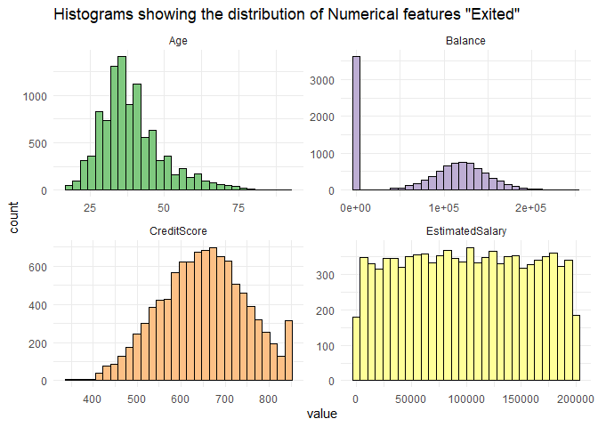

## Class Imbalance

From the bar chart showing the distribution of the response variable
‘Exited’, we can see that 20.37% o the customers have churned and 79.63%
of the customers have not churned. It can be said that almost every
5th customer has churned for this dataset. The dataset is
imbalanced. Methods like undersampling and oversampling will need to be
implemented to reduce this imbalance.
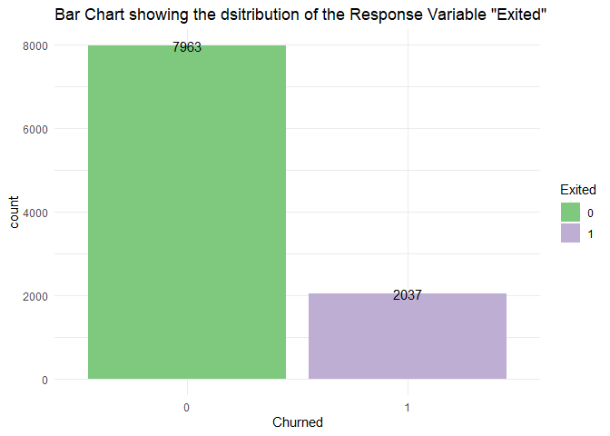

## Gender and Churn

Around 25.07% of the female customers appear to have churned whereas
only 16.45% of the male customers have churned. Churn rate is higher in
females compared to males.

## Number of Products owned by customer and Churn

Customers who have purchased more than 2 products from the bank appear
to churn.

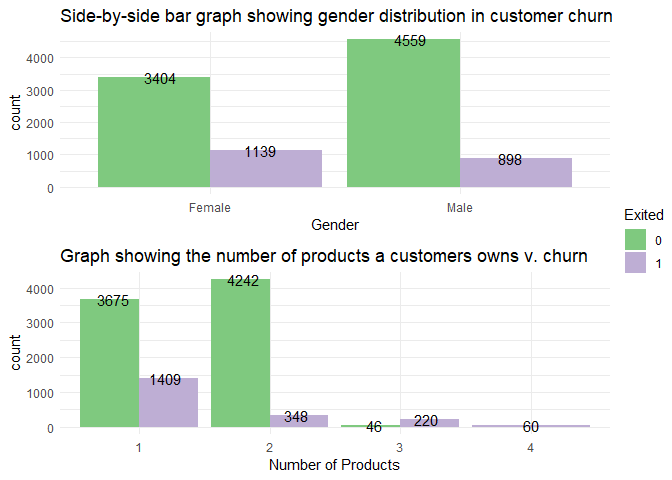

## Credit Card and Churn

20.8% of the customers who do not have a credit card appear to churn and
around 20.18% of the customers who have a credit card appear to churn.

## Region and Churn

15.86% customers from France, 39.5% customers from Germany and 16%
customers from Spain have exited. So, the churn rate is high is Germany
as compared to France and Spain.

## Active Customer and Churn

26.85% of the inactive customers have left the bank as compared to the
14.2% of the active customers. Active customers are less likely to
churn.

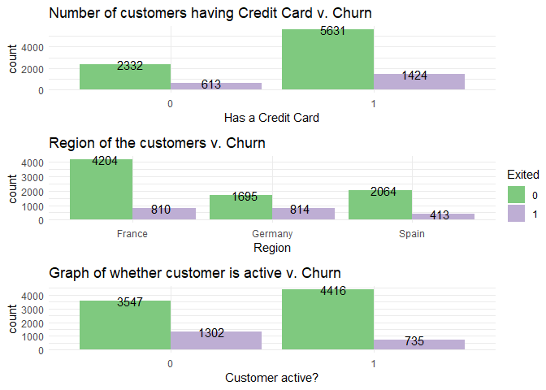

## Balance and Churn

From the box plot showing the distribution of balance, it can be seen
that customers who churn, appear to have higher balance than the ones
who don’t. This is could be because other banks might be offering them
some kind of premium account for customers with high balance.

## Age and Churn

From the box plot showing the distribution of age of the customers,
older customers appear to churn more than the young customers. One
reason for this could be that other banks are offering better savings
options for old age groups.

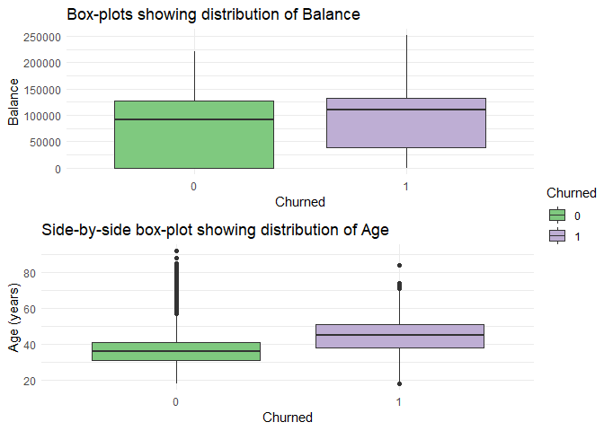

## Credit Score, Salary and Churn

Credit score and Salary of the customers does not seem to have much
effect on a customer’s decision to exit the bank.

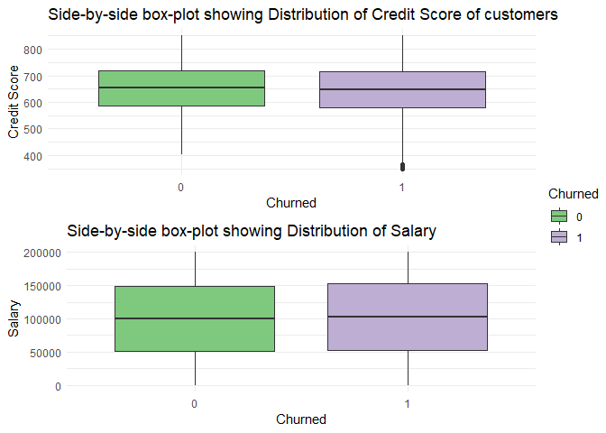

## Correlation Matrix:

We don’t want our features to be correlated too strongly. If the pairs
are strongly correlated it would make including such pairs redundant,
since they influence the result in similar manner. The matrix shows us
that the features don’t appear to be strongly correlated which is good.
Number of products and balance are indirectly correlated.

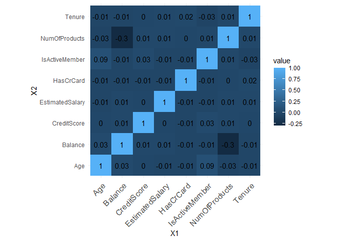

# **PREDICTIVE MODELING**

I created a training dataset containing a random sample of 80% of the
observations and remaining 20% observations in the validation dataset.
From EDA, it was clear that the dataset has class imbalance. To handle
this, the SMOTE function was used. The function oversamples the rare
event to synthetically create additional observations of that event. I
have also used a classification threshold of 0.5 for all models.

## Logistic Regression

Logistic regression is a statistical analysis method used to predict a
data value based pn prior observations of a dataset. Logistic Regression
model predicts a dependent variable by analyzing the relationship
between one or more existing independent variables. For the dataset,
using the glm() function, I calculated the coefficient for every
attribute. From the summary, it can be seen that the significant
features are: Geography (Germany compared to France), Gender (Male
compared to Female), Age, NumOfProducts (2 or 3 products compared to 1)
and IsActiveMember (1 - yes compared to 0 - no).

    ## 
    ## Call:
    ## glm(formula = Exited ~ ., family = binomial, data = train.df)
    ## 
    ## Deviance Residuals: 
    ##      Min        1Q    Median        3Q       Max  
    ## -2.95054  -0.82520  -0.09936   0.87344   2.88597  
    ## 
    ## Coefficients:
    ##                        Estimate     Std. Error z value             Pr(>|z|)    
    ## (Intercept)       -1.8525821247   0.2921254470  -6.342     0.00000000022719 ***
    ## CreditScore       -0.0007847229   0.0003155245  -2.487             0.012881 *  
    ## GeographyGermany   0.8483593378   0.0757975347  11.192 < 0.0000000000000002 ***
    ## GeographySpain     0.2403796152   0.0751566441   3.198             0.001382 ** 
    ## GenderMale        -0.4242694815   0.0603860349  -7.026     0.00000000000213 ***
    ## Age                0.0806742367   0.0032349052  24.939 < 0.0000000000000002 ***
    ## Tenure1           -0.3157217467   0.1553461816  -2.032             0.042116 *  
    ## Tenure2           -0.2851611203   0.1580675827  -1.804             0.071224 .  
    ## Tenure3           -0.2940784758   0.1580239561  -1.861             0.062748 .  
    ## Tenure4           -0.2806720160   0.1586120327  -1.770             0.076802 .  
    ## Tenure5           -0.5545303383   0.1596061682  -3.474             0.000512 ***
    ## Tenure6           -0.2641187716   0.1587178052  -1.664             0.096097 .  
    ## Tenure7           -0.5383882028   0.1603839145  -3.357             0.000788 ***
    ## Tenure8           -0.5884519317   0.1585573859  -3.711             0.000206 ***
    ## Tenure9           -0.5490107139   0.1601901472  -3.427             0.000610 ***
    ## Tenure10          -0.2393261142   0.1864799785  -1.283             0.199356    
    ## Balance            0.0000024178   0.0000005634   4.292     0.00001773500343 ***
    ## NumOfProducts2    -1.0292020869   0.0644089848 -15.979 < 0.0000000000000002 ***
    ## NumOfProducts3     3.1017000200   0.2440582071  12.709 < 0.0000000000000002 ***
    ## NumOfProducts4    15.9903388909 174.0427463013   0.092             0.926797    
    ## HasCrCard1        -0.5566359339   0.0630309639  -8.831 < 0.0000000000000002 ***
    ## IsActiveMember1   -0.7017587981   0.0610683825 -11.491 < 0.0000000000000002 ***
    ## EstimatedSalary    0.0000005535   0.0000005322   1.040             0.298329    
    ## ---
    ## Signif. codes:  0 '***' 0.001 '**' 0.01 '*' 0.05 '.' 0.1 ' ' 1
    ## 
    ## (Dispersion parameter for binomial family taken to be 1)
    ## 
    ##     Null deviance: 9038.6  on 6519  degrees of freedom
    ## Residual deviance: 6618.1  on 6497  degrees of freedom
    ## AIC: 6664.1
    ## 
    ## Number of Fisher Scoring iterations: 15

    ## 
    ## Interpreting Coefficients:

    ##      (Intercept)      CreditScore GeographyGermany   GeographySpain 
    ##             0.16             1.00             2.34             1.27 
    ##       GenderMale              Age          Tenure1          Tenure2 
    ##             0.65             1.08             0.73             0.75 
    ##          Tenure3          Tenure4          Tenure5          Tenure6 
    ##             0.75             0.76             0.57             0.77 
    ##          Tenure7          Tenure8          Tenure9         Tenure10 
    ##             0.58             0.56             0.58             0.79 
    ##          Balance   NumOfProducts2   NumOfProducts3   NumOfProducts4 
    ##             1.00             0.36            22.24       8800674.21 
    ##       HasCrCard1  IsActiveMember1  EstimatedSalary 
    ##             0.57             0.50             1.00

To interpret the significant model coefficients, it can be said that,
Given the customer is from Germany, the log odds of churning (versus not
churning) increases by 0.8483 or it increases by a factor of 2.34 or
134% as compared to customers from France and Spain. So, German
customers are more likely to churn. If the customer is male, the log
odds of churning changes by -0.424 or the chances of churning decreases
by a factor of 0.65 or 35% compared to female customers. If the customer
is associated with two products from the bank, the risk of the customer
churning decreases by a factor of 0.36 or 64%, that is, customers who
have two products are 64% likely to not churn. The log of odds of
churning changes by -1.029. Likewise, given the customer associated with
3 products from the bank, the risk of the customer getting churned is
increased by a factor of 22.24, that is, they are extremely likely to
churn. The log of odds of churning changes by 3.10. If the customer is
an active member of the bank, the risk of the customer getting churned
decreased by a factor of 0.50 or 50%. The log of odds of churning
changes by -0.701.

    ## Confusion Matrix for Training Dataset:

    ## Confusion Matrix and Statistics
    ## 
    ##            Reference
    ## Prediction  Churn Not Churn
    ##   Churn      2390       722
    ##   Not Churn   870      2538
    ##                                                
    ##                Accuracy : 0.7558               
    ##                  95% CI : (0.7452, 0.7662)     
    ##     No Information Rate : 0.5                  
    ##     P-Value [Acc > NIR] : < 0.00000000000000022
    ##                                                
    ##                   Kappa : 0.5117               
    ##                                                
    ##  Mcnemar's Test P-Value : 0.0002294            
    ##                                                
    ##             Sensitivity : 0.7331               
    ##             Specificity : 0.7785               
    ##          Pos Pred Value : 0.7680               
    ##          Neg Pred Value : 0.7447               
    ##              Prevalence : 0.5000               
    ##          Detection Rate : 0.3666               
    ##    Detection Prevalence : 0.4773               
    ##       Balanced Accuracy : 0.7558               
    ##                                                
    ##        'Positive' Class : Churn                
    ## 

    ## Confusion Matrix for Validation Dataset:

    ## Confusion Matrix and Statistics
    ## 
    ##            Reference
    ## Prediction  Churn Not Churn
    ##   Churn       283       333
    ##   Not Churn   124      1259
    ##                                              
    ##                Accuracy : 0.7714             
    ##                  95% CI : (0.7523, 0.7896)   
    ##     No Information Rate : 0.7964             
    ##     P-Value [Acc > NIR] : 0.9972             
    ##                                              
    ##                   Kappa : 0.4082             
    ##                                              
    ##  Mcnemar's Test P-Value : <0.0000000000000002
    ##                                              
    ##             Sensitivity : 0.6953             
    ##             Specificity : 0.7908             
    ##          Pos Pred Value : 0.4594             
    ##          Neg Pred Value : 0.9103             
    ##              Prevalence : 0.2036             
    ##          Detection Rate : 0.1416             
    ##    Detection Prevalence : 0.3082             
    ##       Balanced Accuracy : 0.7431             
    ##                                              
    ##        'Positive' Class : Churn              
    ## 

For training dataset, I obtained an accuracy of 75.58% and for
validation dataset, the accuracy is 77.14%. The AUC for the logistic
regression model was found to be 0.8325

Gain Chart:
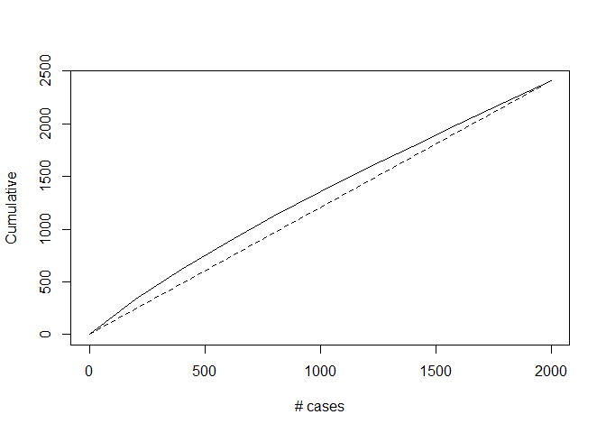

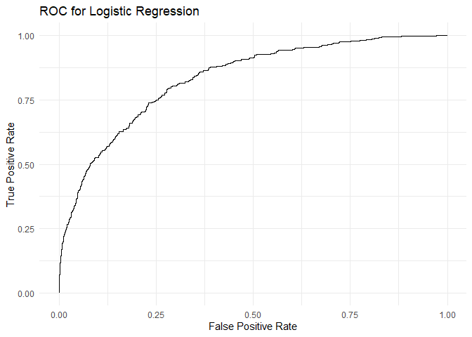

    ## Area under the curve: 0.8326

## Decision Trees

Decision Trees are useful supervised machine learning algorithms which
can perform both regression and classification tasks. Decision trees are
characterized by nodes and branches where the tests on each attribute
are represented at the nodes and the outcome of this procedure is
represented at the branches while the class labels are represented at
the leaf nodes. Using complexity parameter as 0.003 with maximum depth
of 5 and minimum split of 1, the following decision tree was generated.
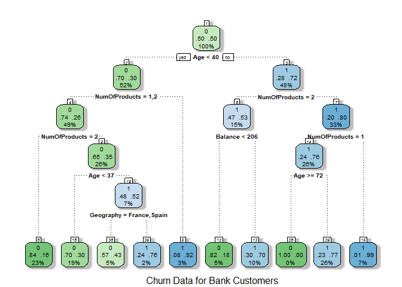
From the decision tree, it can be inferred that there are chances of
customers churning if their age is \>= 40 and they own three or more
products. From Node 13, it can be said that if the customer’s age is
between 37 and 40, and they are from Germany who have only one product,
then their chances of churning are high.

    ## Confusion Matrix for Training Dataset:

    ## Confusion Matrix and Statistics
    ## 
    ##           Reference
    ## Prediction    0    1
    ##          0 2631  801
    ##          1  629 2459
    ##                                                
    ##                Accuracy : 0.7807               
    ##                  95% CI : (0.7704, 0.7907)     
    ##     No Information Rate : 0.5                  
    ##     P-Value [Acc > NIR] : < 0.00000000000000022
    ##                                                
    ##                   Kappa : 0.5613               
    ##                                                
    ##  Mcnemar's Test P-Value : 0.000006127          
    ##                                                
    ##             Sensitivity : 0.7543               
    ##             Specificity : 0.8071               
    ##          Pos Pred Value : 0.7963               
    ##          Neg Pred Value : 0.7666               
    ##              Prevalence : 0.5000               
    ##          Detection Rate : 0.3771               
    ##    Detection Prevalence : 0.4736               
    ##       Balanced Accuracy : 0.7807               
    ##                                                
    ##        'Positive' Class : 1                    
    ## 

    ## Confusion Matrix for Validation Dataset:

    ## Confusion Matrix and Statistics
    ## 
    ##            Reference
    ## Prediction  Churn Not Churn
    ##   Churn       274       313
    ##   Not Churn   133      1279
    ##                                              
    ##                Accuracy : 0.7769             
    ##                  95% CI : (0.758, 0.795)     
    ##     No Information Rate : 0.7964             
    ##     P-Value [Acc > NIR] : 0.9852             
    ##                                              
    ##                   Kappa : 0.4092             
    ##                                              
    ##  Mcnemar's Test P-Value : <0.0000000000000002
    ##                                              
    ##             Sensitivity : 0.6732             
    ##             Specificity : 0.8034             
    ##          Pos Pred Value : 0.4668             
    ##          Neg Pred Value : 0.9058             
    ##              Prevalence : 0.2036             
    ##          Detection Rate : 0.1371             
    ##    Detection Prevalence : 0.2936             
    ##       Balanced Accuracy : 0.7383             
    ##                                              
    ##        'Positive' Class : Churn              
    ## 

For training dataset, I obtained an accuracy of 78.07% and for
validation dataset, the accuracy is 77.69%. The AUC for the logistic
regression model was found to be 0.7979

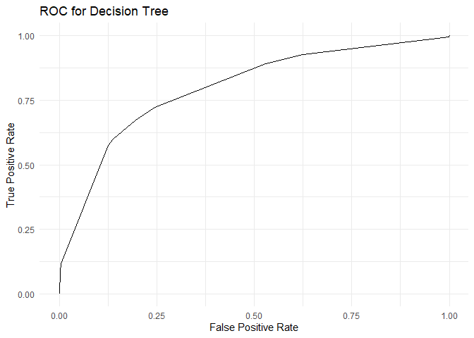

    ## Area under the curve: 0.7979

## Random Forest

Random Forest is a very powerful ensemble machine learning algorithm
which works by creating multiple decision trees and then combines the
output generated by each of the decision trees. To select an optimal
model kappa was used with the largest value using the grid search
definition. So, the final value for the model was mtry = 8. The
Out-of-bag error estimate that is the cases which were not used while
building the tree is 15.81% for the random forest model.

    ## 
    ## Call:
    ##  randomForest(formula = Exited ~ ., data = train.df, mtry = 8,      importance = TRUE) 
    ##                Type of random forest: classification
    ##                      Number of trees: 500
    ## No. of variables tried at each split: 8
    ## 
    ##         OOB estimate of  error rate: 15.81%
    ## Confusion matrix:
    ##      0    1 class.error
    ## 0 2786  474   0.1453988
    ## 1  557 2703   0.1708589

    ##                 MeanDecreaseAccuracy
    ## CreditScore                 58.03191
    ## Geography                   69.79246
    ## Gender                      28.36955
    ## Age                        245.59858
    ## Tenure                      80.27418
    ## Balance                    155.79673
    ## NumOfProducts              206.19209
    ## HasCrCard                   34.88415
    ## IsActiveMember              64.74622
    ## EstimatedSalary             62.76371

From the random forest model, we can infer that the important factors in
deciding whether a customer churns or not are Age, NumOfProducts,
Balance, Tenure, Geography and IsActiveMember.

    ## Confusion Matrix for Validation Dataset:

    ## Confusion Matrix and Statistics
    ## 
    ##            Reference
    ## Prediction  Churn Not Churn
    ##   Churn       306       368
    ##   Not Churn   101      1224
    ##                                              
    ##                Accuracy : 0.7654             
    ##                  95% CI : (0.7462, 0.7838)   
    ##     No Information Rate : 0.7964             
    ##     P-Value [Acc > NIR] : 0.9997             
    ##                                              
    ##                   Kappa : 0.4185             
    ##                                              
    ##  Mcnemar's Test P-Value : <0.0000000000000002
    ##                                              
    ##             Sensitivity : 0.7518             
    ##             Specificity : 0.7688             
    ##          Pos Pred Value : 0.4540             
    ##          Neg Pred Value : 0.9238             
    ##              Prevalence : 0.2036             
    ##          Detection Rate : 0.1531             
    ##    Detection Prevalence : 0.3372             
    ##       Balanced Accuracy : 0.7603             
    ##                                              
    ##        'Positive' Class : Churn              
    ## 

The accuracy of the random forest model was found to be 76.54% for the
validation dataset. The accuracy is little lower as compared to the
accuracy obtained from Decision Tree (77.69%). But, there is a great
improvement in the AUC as the AUC for Random Forest Model is 0.838 as
compared to only 0.7979 of the Decision Tree. The recall or the
sensitivity for the Random forest model (0.751) is also better than
Decision tree (0.673).
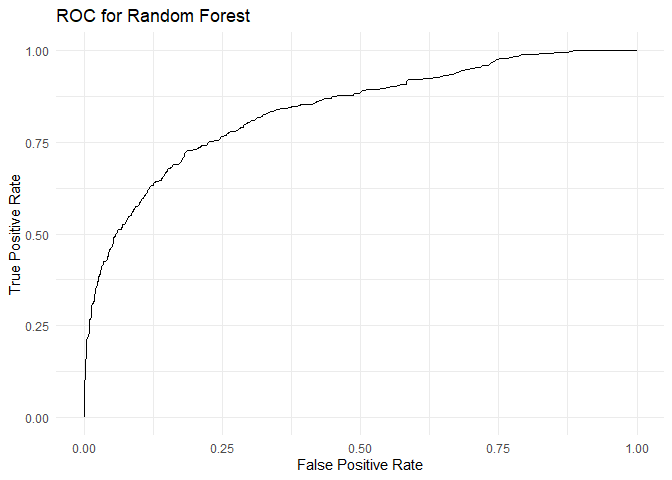

    ## Area under the curve: 0.838

## Support Vector Machines

Support Vector Machine is a supervised learning model in which
classification is performed by finding the hyperplane that best
differentiates two classes. The objective is to find a hyperplane that
that the maximum margin or the maximum distance between the data points
of classes. SVMs can take any shape like linear, radial, polynomial,
among others and are flexible enough to be used in almost any
classification endeavor. For our model, I have created a support vector
machine with radial kernel with a cost of 20.

    ## 
    ## Call:
    ## svm(formula = Exited ~ ., data = train.df, kernel = "radial", cost = 20, 
    ##     probability = TRUE)
    ## 
    ## 
    ## Parameters:
    ##    SVM-Type:  C-classification 
    ##  SVM-Kernel:  radial 
    ##        cost:  20 
    ## 
    ## Number of Support Vectors:  3262
    ## 
    ##  ( 1660 1602 )
    ## 
    ## 
    ## Number of Classes:  2 
    ## 
    ## Levels: 
    ##  0 1

The number of support vectors created were 3262 out of which 1660
belonged to level 0 (Not Churned) and 1602 belonged to level 1
(churned).

    ## Confusion Matrix for Training Dataset:

    ## Confusion Matrix and Statistics
    ## 
    ##           Reference
    ## Prediction    0    1
    ##          0 2751  614
    ##          1  509 2646
    ##                                                
    ##                Accuracy : 0.8278               
    ##                  95% CI : (0.8184, 0.8369)     
    ##     No Information Rate : 0.5                  
    ##     P-Value [Acc > NIR] : < 0.00000000000000022
    ##                                                
    ##                   Kappa : 0.6555               
    ##                                                
    ##  Mcnemar's Test P-Value : 0.001913             
    ##                                                
    ##             Sensitivity : 0.8117               
    ##             Specificity : 0.8439               
    ##          Pos Pred Value : 0.8387               
    ##          Neg Pred Value : 0.8175               
    ##              Prevalence : 0.5000               
    ##          Detection Rate : 0.4058               
    ##    Detection Prevalence : 0.4839               
    ##       Balanced Accuracy : 0.8278               
    ##                                                
    ##        'Positive' Class : 1                    
    ## 

    ## Confusion Matrix for Validation Dataset:

    ## Confusion Matrix and Statistics
    ## 
    ##           Reference
    ## Prediction    0    1
    ##          0 1260  110
    ##          1  332  297
    ##                                              
    ##                Accuracy : 0.7789             
    ##                  95% CI : (0.76, 0.7969)     
    ##     No Information Rate : 0.7964             
    ##     P-Value [Acc > NIR] : 0.9748             
    ##                                              
    ##                   Kappa : 0.4332             
    ##                                              
    ##  Mcnemar's Test P-Value : <0.0000000000000002
    ##                                              
    ##             Sensitivity : 0.7297             
    ##             Specificity : 0.7915             
    ##          Pos Pred Value : 0.4722             
    ##          Neg Pred Value : 0.9197             
    ##              Prevalence : 0.2036             
    ##          Detection Rate : 0.1486             
    ##    Detection Prevalence : 0.3147             
    ##       Balanced Accuracy : 0.7606             
    ##                                              
    ##        'Positive' Class : 1                  
    ## 

Accuracy of 82.78% was obtained for the training dataset. We can
classify 297 out of 407 “Churned” cases correctly and 1260 out of 1592
“Not Churned” cases correctly. This means the ability of SVM to predict
“Churned” cases is about 72.97%  and “Not Churned” cases is about 79.15%
resulting in overall accuracy of 77.89%. The AUC for SVM is 0.8395.
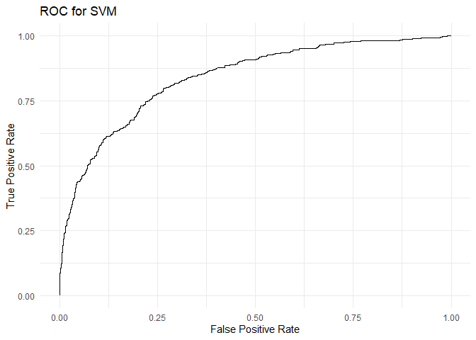

    ## Area under the curve: 0.8395

## eXtreme Gradient Boosting (XGB)

XGBoost (eXtreme Gradient Boosting) algorithm is used for supervised
learning tasks. It is similar to gradient boosting framework but more
efficient. It belongs to a family of boosting algorithms that convert
weak learners to strong learners. Trees are grown using the information
from a previously grown tree one after the other, so boosting is a
sequential process. This improves predictions in subsequent iterations.
Misclassification rate is also reduced in subsequent iterations. XGBoost
works only with numeric vectors. The maximum depth was chosen as 6 (the
tree won’t be deep as our case is simple), gamma was 0.01 and the
learning parameter ‘eta’ was chosen as 0.5 after tuning the model. The
learning parameter controls how much information from a new tree will be
used in the Boosting whereas the gamma parameter controls the minimum
reduction required to grow a new node in a tree.

    ## eXtreme Gradient Boosting 
    ## 
    ## 6520 samples
    ##   10 predictor
    ##    2 classes: '0', '1' 
    ## 
    ## No pre-processing
    ## Resampling: Cross-Validated (10 fold) 
    ## Summary of sample sizes: 5868, 5868, 5868, 5868, 5868, 5868, ... 
    ## Resampling results:
    ## 
    ##   Accuracy   Kappa    
    ##   0.7826687  0.5653374
    ## 
    ## Tuning parameter 'nrounds' was held constant at a value of 1
    ## Tuning
    ##  held constant at a value of 1
    ## Tuning parameter 'subsample' was held
    ##  constant at a value of 1

    ## Confusion Matrix for Training Dataset:

    ## Confusion Matrix and Statistics
    ## 
    ##            Reference
    ## Prediction  Churn Not Churn
    ##   Churn      2421       475
    ##   Not Churn   839      2785
    ##                                                
    ##                Accuracy : 0.7985               
    ##                  95% CI : (0.7885, 0.8081)     
    ##     No Information Rate : 0.5                  
    ##     P-Value [Acc > NIR] : < 0.00000000000000022
    ##                                                
    ##                   Kappa : 0.5969               
    ##                                                
    ##  Mcnemar's Test P-Value : < 0.00000000000000022
    ##                                                
    ##             Sensitivity : 0.7426               
    ##             Specificity : 0.8543               
    ##          Pos Pred Value : 0.8360               
    ##          Neg Pred Value : 0.7685               
    ##              Prevalence : 0.5000               
    ##          Detection Rate : 0.3713               
    ##    Detection Prevalence : 0.4442               
    ##       Balanced Accuracy : 0.7985               
    ##                                                
    ##        'Positive' Class : Churn                
    ## 

    ## Confusion Matrix for Validation Dataset:

    ## Confusion Matrix and Statistics
    ## 
    ##            Reference
    ## Prediction  Churn Not Churn
    ##   Churn       257       251
    ##   Not Churn   150      1341
    ##                                           
    ##                Accuracy : 0.7994          
    ##                  95% CI : (0.7812, 0.8168)
    ##     No Information Rate : 0.7964          
    ##     P-Value [Acc > NIR] : 0.3819          
    ##                                           
    ##                   Kappa : 0.4337          
    ##                                           
    ##  Mcnemar's Test P-Value : 0.0000005921    
    ##                                           
    ##             Sensitivity : 0.6314          
    ##             Specificity : 0.8423          
    ##          Pos Pred Value : 0.5059          
    ##          Neg Pred Value : 0.8994          
    ##              Prevalence : 0.2036          
    ##          Detection Rate : 0.1286          
    ##    Detection Prevalence : 0.2541          
    ##       Balanced Accuracy : 0.7369          
    ##                                           
    ##        'Positive' Class : Churn           
    ## 

The accuracy obtained from the model is the highest at 79.93% for the
validation dataset and it is 79.85 for the training dataset. We can
classify 257 out of 407 “Churned” cases correctly and 1341 out of 1592
“Not Churned” cases correctly. This means the ability of XGB to predict
“Churned” cases is about 63.14%  and “Not Churned” cases is about 84.3%
resulting in overall accuracy of 79.94%. The AUC for XGB model is
0.8249.
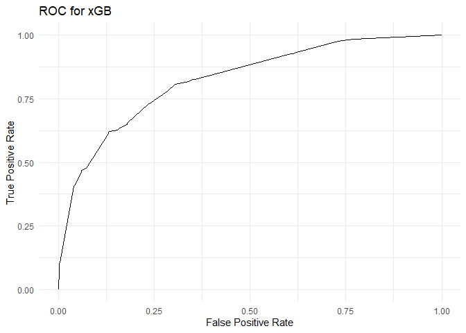

    ## Area under the curve: 0.8249

## Naïve Bayes

Naïve Bayes is a supervised machine learning algorithm that uses a
probabilistic approach. Since the predictors aren’t always independent
of each other, there are always some correlations between them. Naïve
Bayes considers each predictor to be independent of each other. Naïve
Bayes classifiers can perform well even with high-dimensional data
points or large number of data points. The model creates conditional
probability for each feature separately and we also get a-priori
probabilities which indicate the distribution of the data. The a-priori
probabilities and the conditional probabilities of Churn in the Bank
dataset is as follows:

    ## 
    ## Naive Bayes Classifier for Discrete Predictors
    ## 
    ## Call:
    ## naiveBayes.default(x = X, y = Y, laplace = laplace)
    ## 
    ## A-priori probabilities:
    ## Y
    ##   0   1 
    ## 0.5 0.5 
    ## 
    ## Conditional probabilities:
    ##    CreditScore
    ## Y       [,1]     [,2]
    ##   0 656.9896 95.85683
    ##   1 649.7117 94.68906
    ## 
    ##    Geography
    ## Y      France   Germany     Spain
    ##   0 0.5319018 0.2180982 0.2500000
    ##   1 0.3895706 0.3815951 0.2288344
    ## 
    ##    Gender
    ## Y      Female      Male
    ##   0 0.4423313 0.5576687
    ##   1 0.5266871 0.4733129
    ## 
    ##    Age
    ## Y       [,1]      [,2]
    ##   0 37.27454 10.310629
    ##   1 44.81025  8.970812
    ## 
    ##    Tenure
    ## Y            0          1          2          3          4          5
    ##   0 0.04631902 0.10368098 0.10092025 0.09570552 0.09662577 0.10245399
    ##   1 0.05490798 0.11503067 0.09969325 0.11533742 0.09509202 0.09601227
    ##    Tenure
    ## Y            6          7          8          9         10
    ##   0 0.08957055 0.10889571 0.10705521 0.10398773 0.04478528
    ##   1 0.09907975 0.08558282 0.09570552 0.09079755 0.05276074
    ## 
    ##    Balance
    ## Y       [,1]     [,2]
    ##   0 73903.97 62554.72
    ##   1 93960.57 54578.80
    ## 
    ##    NumOfProducts
    ## Y             1           2           3           4
    ##   0 0.460429448 0.533742331 0.005828221 0.000000000
    ##   1 0.579754601 0.229754601 0.141411043 0.049079755
    ## 
    ##    HasCrCard
    ## Y           0         1
    ##   0 0.2981595 0.7018405
    ##   1 0.4070552 0.5929448
    ## 
    ##    IsActiveMember
    ## Y           0         1
    ##   0 0.4460123 0.5539877
    ##   1 0.5625767 0.4374233
    ## 
    ##    EstimatedSalary
    ## Y        [,1]     [,2]
    ##   0  98281.92 57980.67
    ##   1 100533.71 55111.33

From the result, we can infer that, given the customer is from Germany,
there are 38.15% chances of them churning or given the customer is a
female, there are 52.68% chances of churning. Similarly, attrition can
be deduced for the other features using the conditional probabilities of
the Naïve Bayes Model.

    ## Confusion Matrix for Training Dataset:

    ## Confusion Matrix and Statistics
    ## 
    ##            Reference
    ## Prediction  Churn Not Churn
    ##   Churn      2422       795
    ##   Not Churn   838      2465
    ##                                              
    ##                Accuracy : 0.7495             
    ##                  95% CI : (0.7388, 0.76)     
    ##     No Information Rate : 0.5                
    ##     P-Value [Acc > NIR] : <0.0000000000000002
    ##                                              
    ##                   Kappa : 0.4991             
    ##                                              
    ##  Mcnemar's Test P-Value : 0.2986             
    ##                                              
    ##             Sensitivity : 0.7429             
    ##             Specificity : 0.7561             
    ##          Pos Pred Value : 0.7529             
    ##          Neg Pred Value : 0.7463             
    ##              Prevalence : 0.5000             
    ##          Detection Rate : 0.3715             
    ##    Detection Prevalence : 0.4934             
    ##       Balanced Accuracy : 0.7495             
    ##                                              
    ##        'Positive' Class : Churn              
    ## 

    ## Confusion Matrix for Validation Dataset:

    ## Confusion Matrix and Statistics
    ## 
    ##            Reference
    ## Prediction  Churn Not Churn
    ##   Churn       288       378
    ##   Not Churn   119      1214
    ##                                              
    ##                Accuracy : 0.7514             
    ##                  95% CI : (0.7318, 0.7702)   
    ##     No Information Rate : 0.7964             
    ##     P-Value [Acc > NIR] : 1                  
    ##                                              
    ##                   Kappa : 0.3801             
    ##                                              
    ##  Mcnemar's Test P-Value : <0.0000000000000002
    ##                                              
    ##             Sensitivity : 0.7076             
    ##             Specificity : 0.7626             
    ##          Pos Pred Value : 0.4324             
    ##          Neg Pred Value : 0.9107             
    ##              Prevalence : 0.2036             
    ##          Detection Rate : 0.1441             
    ##    Detection Prevalence : 0.3332             
    ##       Balanced Accuracy : 0.7351             
    ##                                              
    ##        'Positive' Class : Churn              
    ## 

We can classify 288 out of 407 “Churned” cases correctly and 1214 out of
1592 “Not Churned” cases correctly. This means the ability of Naïve
Bayes to predict “Churned” cases is about 70.76% and “Not Churned” cases
is about 76.26% resulting in overall accuracy of 75.14%. The AUC for
Naïve Bayes model is 0.8214.
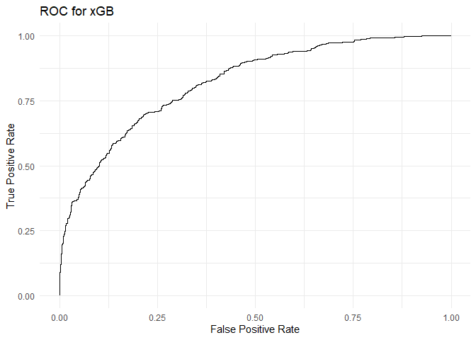

    ## Area under the curve: 0.8214

## K-Nearest Neighbors

K-Nearest neighbor (KNN) classifies a new data point into the target
class, depending of the features of its neighboring data points. It is
one of the most simple machine learning algorithms. Determining the
value of k, that is, choosing the number of nearest neighbors plays a
significant role in determining the efficacy of the model. It determines
how well the data can be utilized to generalize the results of the kNN
algorithm. A large k value reduces the variance due to the noisy data
but it maby also develop a bias. So, it is better to choose an optimal
value of k. Based on the accuracy of the optimal model using the largest
value, the value of the number of nearest neighbors was chosen to be 17.

    ## k-Nearest Neighbors 
    ## 
    ## 6520 samples
    ##   10 predictor
    ##    2 classes: '0', '1' 
    ## 
    ## Pre-processing: centered (10), scaled (10) 
    ## Resampling: Bootstrapped (25 reps) 
    ## Summary of sample sizes: 6520, 6520, 6520, 6520, 6520, 6520, ... 
    ## Resampling results across tuning parameters:
    ## 
    ##   k   Accuracy   Kappa    
    ##    5  0.7121002  0.4240904
    ##    7  0.7148006  0.4294965
    ##    9  0.7179030  0.4357032
    ##   11  0.7216231  0.4431647
    ##   13  0.7239159  0.4477772
    ##   15  0.7279531  0.4558557
    ##   17  0.7298403  0.4596243
    ## 
    ## Accuracy was used to select the optimal model using the largest value.
    ## The final value used for the model was k = 17.

    ## Confusion Matrix for Training Dataset:

    ## Confusion Matrix and Statistics
    ## 
    ##            Reference
    ## Prediction  Churn Not Churn
    ##   Churn      2461       646
    ##   Not Churn   799      2614
    ##                                                
    ##                Accuracy : 0.7784               
    ##                  95% CI : (0.7681, 0.7884)     
    ##     No Information Rate : 0.5                  
    ##     P-Value [Acc > NIR] : < 0.00000000000000022
    ##                                                
    ##                   Kappa : 0.5567               
    ##                                                
    ##  Mcnemar's Test P-Value : 0.00006371           
    ##                                                
    ##             Sensitivity : 0.7549               
    ##             Specificity : 0.8018               
    ##          Pos Pred Value : 0.7921               
    ##          Neg Pred Value : 0.7659               
    ##              Prevalence : 0.5000               
    ##          Detection Rate : 0.3775               
    ##    Detection Prevalence : 0.4765               
    ##       Balanced Accuracy : 0.7784               
    ##                                                
    ##        'Positive' Class : Churn                
    ## 

    ## Confusion Matrix for Validation Dataset:

    ## Confusion Matrix and Statistics
    ## 
    ##            Reference
    ## Prediction  Churn Not Churn
    ##   Churn       313       471
    ##   Not Churn    94      1121
    ##                                              
    ##                Accuracy : 0.7174             
    ##                  95% CI : (0.6971, 0.737)    
    ##     No Information Rate : 0.7964             
    ##     P-Value [Acc > NIR] : 1                  
    ##                                              
    ##                   Kappa : 0.3519             
    ##                                              
    ##  Mcnemar's Test P-Value : <0.0000000000000002
    ##                                              
    ##             Sensitivity : 0.7690             
    ##             Specificity : 0.7041             
    ##          Pos Pred Value : 0.3992             
    ##          Neg Pred Value : 0.9226             
    ##              Prevalence : 0.2036             
    ##          Detection Rate : 0.1566             
    ##    Detection Prevalence : 0.3922             
    ##       Balanced Accuracy : 0.7366             
    ##                                              
    ##        'Positive' Class : Churn              
    ## 

KNN classified 313 out of 407 “Churned” cases correctly and 1121 out of
1592 “Not Churned” cases correctly. So, the ability of k-Nearest
Neighbors to predict “Churned” cases is about 76.9% and “Not Churned”
cases are about 70.41% resulting in overall accuracy of 71.75%. The AUC
for k-Nearest Neighbors model is 0.8176

    ## Area under the curve: 0.8176

# **IMPORTANCE OF PREDICTORS**

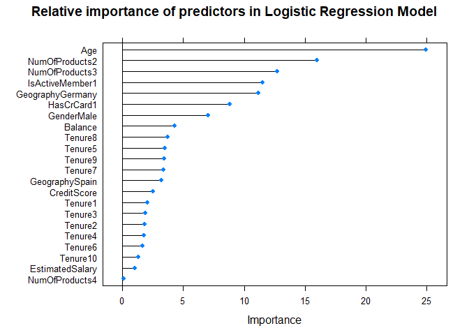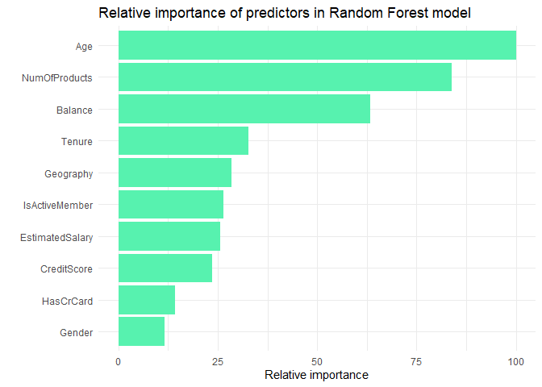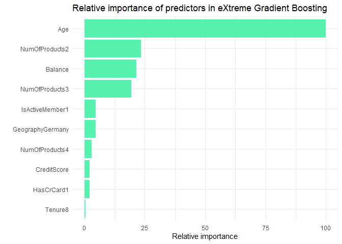
As it can be seen from the plots for important predictors in Logistic
Regression model, Random Forest model and xGB model, the top 6 most
important variables (age, numOfPoducts2, Balance, Tenure,
numOfProducts3, isActiveMember1, GeographyGermany) for each of the model
are close to each other. However, for Random Forest model, Balance and
Tenure appear to be quite important compared to Logistic Regression
model and xGB model. As for the rest of the predictors, **age**,
**numOfPoducts2**, **numOfProducts3**, **isActiveMember1**,
**GeographyGermany** constitute a set of variables of high importance.
In other words, it can be said that, these predictors are very useful in
predicting customer’s churning behavior for this given dataset.

# **COMPARISON OF MODELS**

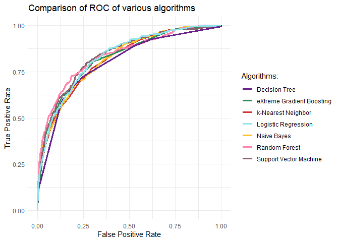

    ##                   Algorithm  Accuracy Sensitivity Specificity    NIR       AUC
    ## 1       Logistic Regression 0.7713857   0.6953317   0.7908291 0.7964 0.8325797
    ## 2             Decision Tree 0.7768884   0.6732187   0.8033920 0.7964 0.7979355
    ## 3             Random Forest 0.7653827   0.7518428   0.7688442 0.7964 0.8379814
    ## 4    Support Vector Machine 0.7788894   0.7297297   0.7914573 0.7964 0.8394938
    ## 5 eXtreme Gradient Boosting 0.7993997   0.6314496   0.8423367 0.7964 0.8249370
    ## 6               Naive Bayes 0.7513757   0.7076167   0.7625628 0.7964 0.8214336
    ## 7        k-Nearest Neighbor 0.7173587   0.7690418   0.7041457 0.7964 0.8176401

Comparing all the models with threshold of 0.5, we see that Naïve Bayes
model has the lowest accuracy of 75.13% as compared to eXtreme Gradient
Boosting model with the accuracy of 79.93%. The model with the highest
recall or sensitivity, that is the proportion of actual “Churned” that
got predicted as "Churned’, is Random Forest model with a recall of
75.18%. Support Vector Machine model has the highest AUC of 0.839 among
all the models that were created. Considering a **threshold of 0.5**,
the No Information Rate is 0.7964. All the other models except the
eXtreme Gradient Boosting model have an accuracy lower than the No
Information Rate, so they are downright lousy. Now, if XGB model is
chosen, it has very low sensitivity. Considering all the aspects, I
would go with Random Forest model as it has a good accuracy (76.53%),
good recall (75.18%), better specificity (76.88%) and has the second
highest AUC (0.837).

# **CONCLUSION**

It is important to identify the attrition rate for a business, as it
tells how the business is doing. If the attrition rate is high, it
indicates that there is some problem with the organization. Once the
churning customer clusters are predicted, banks can take decisions to
provide personalized offers to retain customers and save their revenue.
From the variable importance charts, we can see that age has the highest
impact on customer attrition. Higher the age of the customer, more
likely they are to churn. Banks should come up with premium accounts and
offer preference to such customers’ needs. Another issue could be the
fees associated with the maintenance of these accounts. These customers
should feel that they are being taken care of by offering them better
customer experience. We also see that the number of products used by a
customer has a very huge impact on customer churn. People who use more
than two products are very likely to churn. This could be due to the
fees associated with the products of the return rates offered for these
products are less as compared to the competitors. Banks could implement
long term strategy to offer lower fees on entry-level products and
better rates on more profitable products, this will help to increase the
customer lifetime value and increase the loyalty. The rate of customer
churn in the customers from Germany is also very high. One reason behind
this could be limited number of physical branches of the bank in the
area or lack of in-person guidance from a valued advisors. Banks should
start examining why this could happen and the marketing team in Germany
should spend more time in retaining customers in the region.

With a better dataset, the customers prone to churning can be predicted
using the classification algorithms. As not everyone can be pleased, so
customer attrition is an unavoidable problem, but it can be addressed as
early as possible to understand what processes or factors can be
improved and looked after.

# **REFERENCES**

1.  <https://www.kaggle.com/mathchi/churn-for-bank-customers>

2.  <https://hbr.org/2014/10/the-value-of-keeping-the-right-customers>

3.  <https://www.qualtrics.com/blog/customer-churn-banking/>

4.  <https://www.hranalytics101.com/how-to-assess-model-accuracy-the-basics/>
